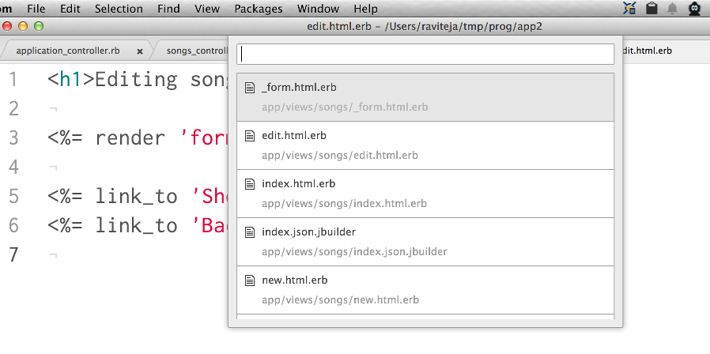

# Atom Rails Related Files package

## Note
I've stopped using atom and don't have time to update code for this package. PR always welcome.

Atom plugin to quickly find and open files realted files in project using `shift-cmd-e`.

  * `shift-cmd-e` to open and navigate a list of realted files

Quickly navigate in your project between files based on realated file regular expession patterns.

Ruby on Rails patterns are included in the package. Can be extended with custom patterns.

Code for navigation popup is from [atom-fuzzy-finder](https://github.com/atom/fuzzy-finder). Regular expesssions are from [Sublime Related files](https://github.com/fabiokr/sublime-related-files) package.

